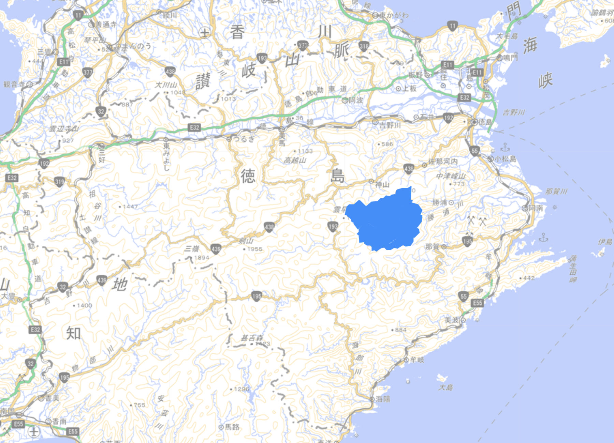
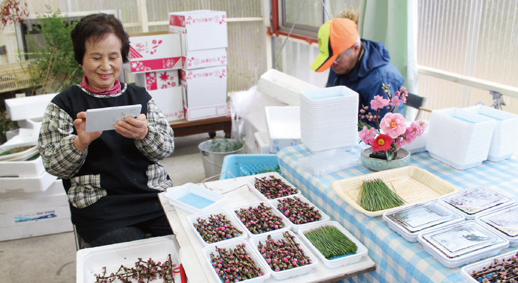
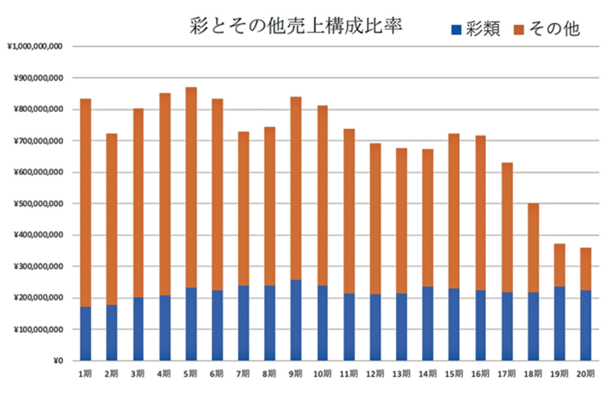
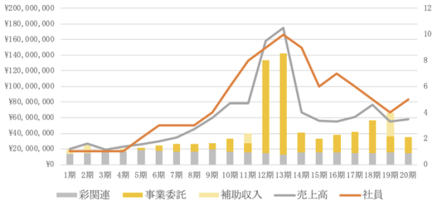

<!--
headingDivider: 1
-->

 

### **いろどり：葉っぱの町  徳島県上勝町から**

### **人と社会に喜びと感動を届ける事業**

 
 

### ②&emsp;柴田青賢

# 取組の場所

 

## 徳島県上勝町

<!-- <iframe
  src="https://www.google.com/maps/embed?pb=!1m18!1m12!1m3!1d52983.42745034444!2d134.33640488417691!3d33.90345014244861!2m3!1f0!2f0!3f0!3m2!1i1024!2i768!4f13.1!3m3!1m2!1s0x3553aa3e884c96ed%3A0xa0f2d19e20430edf!2z5b6z5bO255yM5Yud5rWm6YOh5LiK5Yud55S6!5e0!3m2!1sja!2sjp!4v1734171894488!5m2!1sja!2sjp"
  width="100%"
  height="500"
  style="border:0;"
  allowfullscreen=""
  loading="lazy"
  referrerpolicy="no-referrer-when-downgrade"
></iframe> -->

# 取組の経緯&nbsp;-&nbsp;きっかけ

<!--
きっかけは？なぜ始まった？
何か問題だったのか？（どのような問題を解決しようとしたのか？）
取り組みの主体（組織名）は？
キーパーソンは誰（仕掛け人など）か？
どのような役割を果たしたか？
（★ 通し番号 ⑦、⑧ 以外は必ず書く）
-->

農協の営農指導員をしていた横石氏が、料理店でモミジの葉っぱを持ち帰る女性を見てひらめいたことから始まった。

# 取組の経緯&nbsp;-&nbsp;地域が抱えていた問題

 

主要産業であったみかんが冷害によって**全滅**

↓

町の主要産業がなくなって**仕事がなくなる**

↓

働いていない人が増え、**人に活気がなっていた**

# 取組の経緯&nbsp;-&nbsp;キーパーソン

 

## 横石知二

### 果たした役割

- **つまもの**\*に着目
- **お年寄りだからこそ**できる仕事の創出
- 市場の需要や産地の情報を集め、**ビジネスモデルを創出**
- 生産者同士が競いあう環境を用意して**人を活気づける**

 

\***つまもの**：お膳や和菓子などの日本食に華を添える食用植物

<!--
# 取組の経緯・内容
## ＜内容＞

取組内容を具体的に（基本的な情報は省略せずに書く）
図表や写真などを貼り付けて、伝わりやすい資料にする
　（★ 写真を必ず使用する）
※スペースが不足する場合はシートの追加 OK
-->

# 取組の内容&nbsp;-&nbsp;いろどり農業とは

 
 

 

料理に使われる**つまもの** を  
**いろどり**ブランドとして販売

南天やモミジなど種類は 300 を超える

上勝町の**女性**、特に**高齢者**が中心に生産を担う

&nbsp;→&nbsp;自然の豊かな環境で生活してきた経験を活かす

 
株式会社いろどり,「引き合いの強い！！。 - 株式会社いろどり」,https://irodori.co.jp/2024/12/23/引き合いの強い！！。/
,閲覧日 2024/12/25

# 取組の内容&nbsp;-&nbsp;IT の導入

 
 

いろどりからの受注を管理する**IT システム**の作成と導入

 

## システム概要

当日の発注された内容をタブレットで共有

↓

先着順で生産者が収穫する作物を選ぶ

 

 
株式会社いろどり,「事業紹介 - 株式会社いろどり」,https://irodori.co.jp/about/,閲覧日 2024/12/25

# 取組の成果

<!--
成果を具体的に数値（事業所・従業者・売上の創出・増加など）で示す
図表や写真などがあれば貼り付けて、伝わりやすい資料にする
-->

 

 

大西 正泰,「株式会社いろどりの事業分析からみた「地域プロデューサー」の一考察」,吉備国際大学研究紀要（人文・社会科学系）,N.32,p.88,2022
大西 正泰,「株式会社いろどりの変容（１）」,地域活性学会 中国四国支部会合（支部会・研究会）,N.7,2020

 

- つまもの事業によって安定した収益が上がっている
- 事業の拡大に伴って社員数も増加している

# 取組の課題

<!--
今後、解決すべき問題点（課題）を「２点」具体的に示す
　（「自分の考え」を記述する）
図表や写真などを貼り付けて、伝わりやすい資料にする
-->

 

## 後継者不足

- 担い手には長年の知識と経験が求められる  
  → 後継者を育成するのが困難である

## つまもの需要の不安定性

- つまものは飲食店での需要がほとんど占める  
  → 取引先の飲食店の経営状態に売上が左右される
- 飲食店側には上勝町から購入しなければならない理由がない
  → 競合相手との競争が常に存在する

# 改善提案

<!--
地域経済・産業の活性化という視点で、どうすれば取組がより良いものになるか、「自分の考え」として具体的に「３点」提案する
「３点」のうち「１点」は、先述の課題の解決策を提案する
図表や写真などを貼り付けて、伝わりやすい資料にする
＜改善提案３点＞
① 　・・・
② 　・・・
③ 　・・・
-->

## 上勝町ブランドの強化

## 温かみのある人間関係のある町づくり

## 内需の拡大

# 改善提案 - 上勝町ブランドの強化

 

- つまものが**地域ブランド**として認知されるような活動をする
- 代替品の存在がないような**独自性**を持たせる
- 高級路線を主軸として、食事に+α の価値を求めるお客さんを持つ店を主軸のターゲットに据える

# 改善提案 - 温かみのある人間関係のある町づくり

 
 

- **豊かな自然**という価値を残すために過度な開発は行えない
  - 地域として抱えられる人口には限度がある
  - 観光地化にも限界がある
- 住民同士の**横のつながりの強い**社会システムを残していく
  - つながりで支え合う日本の昔ながらの町を残す
  - 一極集中型の都市システムを望まない人を呼び込む

# 改善提案 - 内需の拡大

 

- つまものによって生まれた**収入の地域内での消費**を促す
- つまものによって得た収入は地域の外から得た資金である
- その資金を地域の外で利用するのではなく  
  → 内部で循環させて地域の持つ**資金を充実させる**

<!-- # 参考文献

[1] 大西正泰 , 株式会社いろどりの事業分析からみた「地域プロデューサー」の一考察 , 吉備国際大学研究紀要（人文・社会科学系 , N.32 , p88 , 2022

[2] 総務省官民連携型人材育成普及実証研究事業, ～ いろどり農業に学ぶ ～官民連携人材育成モデル事業報告書, https://www.soumu.go.jp/main_content/000115387.pdf ,
閲覧日 2024/12/25

[3] 横石知二,タブレット端末を使って稼ぐいろどりばあちゃん軍団,調査研究情報誌 ECPR,N.1,2013,pp21-24 -->
