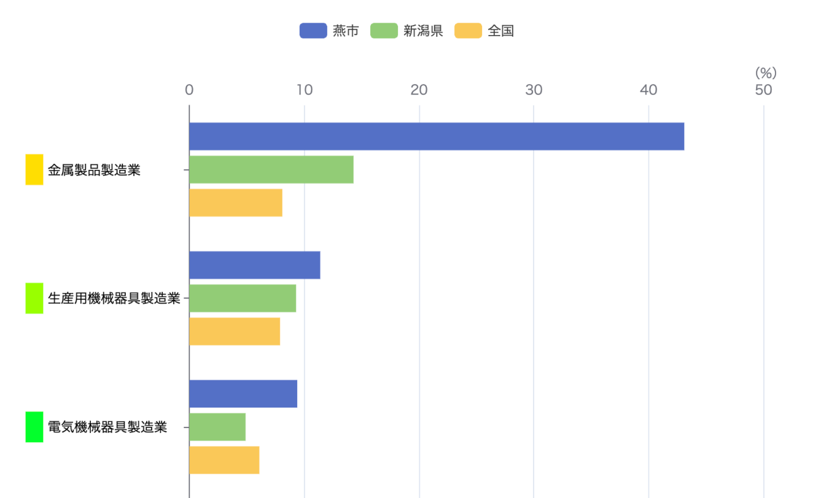

**新潟県 燕市**

- 製造業が必ずトップになる

ファイル名
【RESAS課題】15・柴田青賢.pptx

鉱業、採石業、砂利採取業は選ばない

総人口
77,201人
年少人口
8,863人
11.48
生産年齢人口
43,797人
56.73
老年人口
24,060人
31.17

生
426
死
1098
転入
1900
転出
1939

金属製品
43.1/8.1 = 5.32

生産用機械
11.4/7.9 = 1.44

電気機械
9.4/6.1 = 1.54
